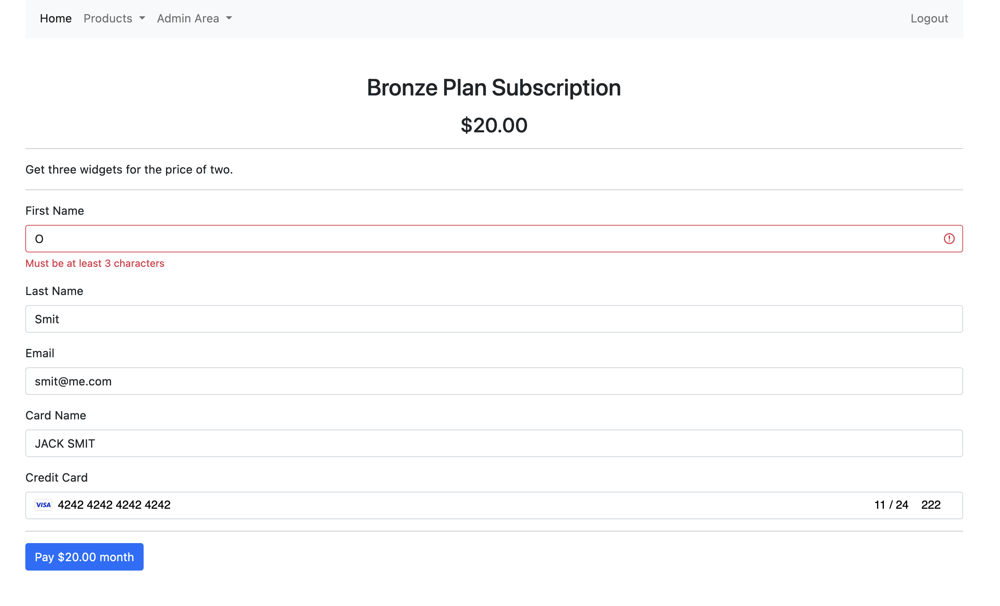

# Go Ecommerce Stripe

Simple ecommerce app, build with Go as backend and frontend, with stripe payments, subscriptions amd cancel stripe operations, email and invoice sending,
token authentication and admin pages to manage users, payments and subscriptions.

## How to prepare

Create `.env` file and fill it from example.

Crate account in the https://mailtrap.io/ and fill credentials.

It uses soda to create migrations and migrate it to database, https://gobuffalo.io/documentation/database/soda/

## How to start

Start db service in docker-compose via `make db` or directly and type command `soda migrate`

To use air start servives

`make air_app`

`make air_api`

`make air_invoice`

or use another command from Makefile to build and start services.

